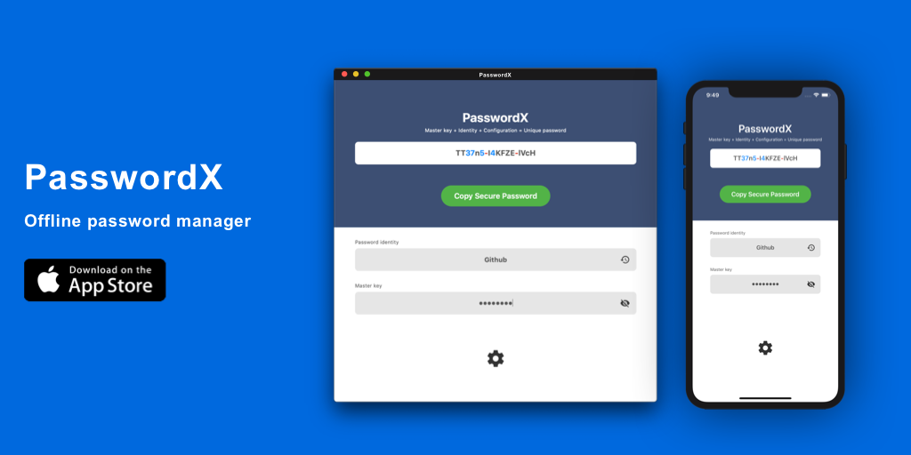

# PasswordX
> Offline password manager for iOS/Mac

### Appstore

iOS [https://apps.apple.com/us/app/id1483366606]https://apps.apple.com/us/app/id1483366606

macOS [https://apps.apple.com/us/app/id1483367513]https://apps.apple.com/us/app/id1483367513

---

### English

**PasswordX** is an offline password generator. You can generate strong passwords with password mnemonics and master passwords and your own password generation rules. No cloud services, no internet, as long as you have installed this app. You can get your password on either Mac or iOS. PasswordX also supports password auto-filling on iOS, you can use PasswordX more conveniently on web pages and other apps.

For example: to generate a password for GitHub, I just enter **Identity** : `github`, **MasterKey** : `password`, and then the system default configuration: `AES256`, and then generate the password:  `TZFIE7-K9G3lT-HoRQcVH`

We support password custom styles:
- Password length
- Password character set: numbers, uppercase letters, lowercase letters, symbols
- Password style symbols: none, comma, period, underscore, hyphen
- Encryption method: MD5, SHA1, SHA224, SHA256, SHA384, SHA512, CRC32, CRC32C, CRC16, AES128, AES192, AES256, ChaCha20, Rabbit, Blowfish

---

### 中文

**PasswordX** 是一款离线的密码生成器。你可以通过密码帮记符和主密码和你专属的密码生成规则去生成强密码。无需云服务，无需网络，只要你装了这个APP。无论是在Mac还是在iOS上你都能获取你的密码。在iOS上PasswordX还支持密码自动填充功能，你可以在网页和其他APP上更加方便的使用PasswordX。

例如：生成GitHub的密码，我只要输入 **Identity**： `github`， **MasterKey**：`password`， 然后系统默认的配置： `AES256`， 然后就生成了密码： `TZFIE7-K9G3lT-HoRQcVH`

我们支持密码定制样式方式：

- 密码长度

- 密码字符集：数字, 大写字母,  小写字母, 符号

- 密码风格符号：无, 逗号, 句号, 下划线, 连字号

- 加密方式： MD5, SHA1, SHA224, SHA256, SHA384, SHA512, CRC32, CRC32C, CRC16, AES128, AES192, AES256, ChaCha20, Rabbit, Blowfish

  
  
---
  

## Requirements

- Swift 5.0

- iOS 13.0+

- Xcode 11.0
  

---

## Contribute

We would love for you to contribute to **PasswordX**, check the `LICENSE` file for more info.

---

## Meta

TBXark – [@tbxark](https://twitter.com/tbxark) – tbxark@outlook.com

Distributed under the MIT license. See ``LICENSE`` for more information.

[https://github.com/TBXark](https://github.com/TBXark)
